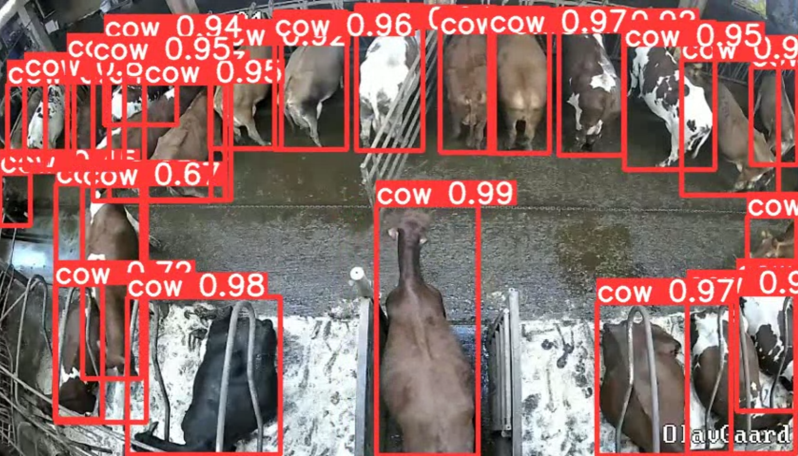
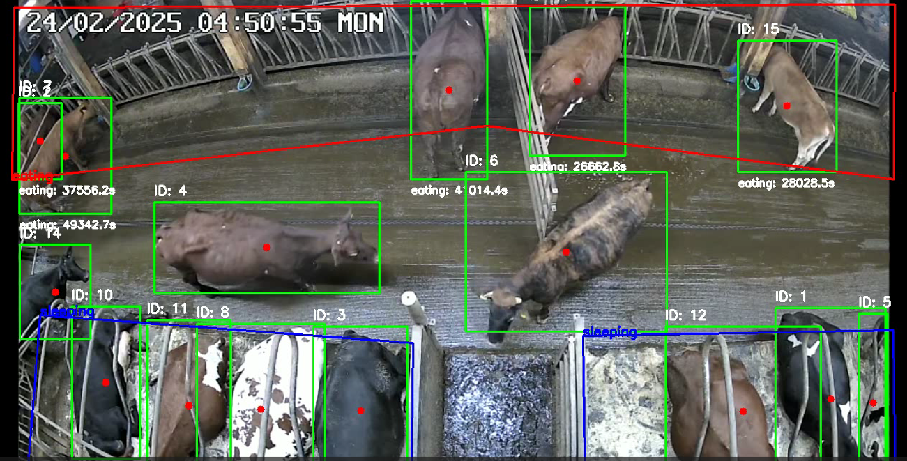
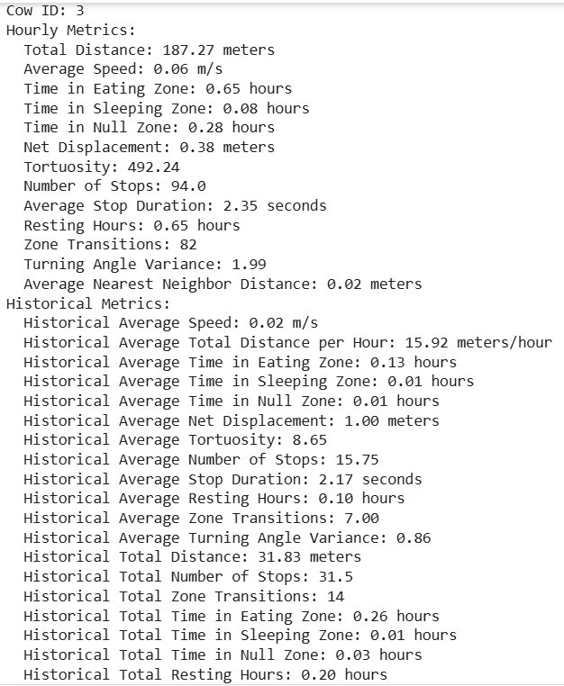
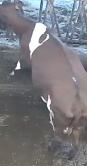
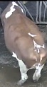

AgroIntel Cattle Monitoring – Project Files Overview

This repository contains the main components of the AgroIntel cattle monitoring system. Below is a brief description of each file:

AgroIntel_YOLOV8TrainModel.ipynb  
Trains a YOLOv8 object detection model to localize cows in barn video frames using a labeled dataset. Includes data loading, training configuration, model evaluation, and saving the trained weights.

Detection output:

Detection_Tracking.py  
Performs real-time detection and tracking of cows using the trained YOLOv8 model along with the ByteTrack algorithm. It logs cow positions, assigns consistent IDs, tracks time in different barn zones, and uploads data to Firebase.

Detection & Tracking output:

AgroIntel_Feature_Extraction_Analysis.ipynb  
Processes tracked cow movement data to extract behavioral features such as speed, total distance traveled, number of stops, time spent in eating/sleeping zones, and zone transitions for each cow. Compiles and uploads activity snapshots with 33 activity features for each cow to our firebase database every hour. 

Example Activity Snapshot:

AgroIntel_Prediction_Model.ipynb  
Trains and evaluates a machine learning model to predict whether a cow is healthy, sick, or in estrus (heat) with synthetic data, based on extracted behavioral features.

Train_reID.py
Trains the reID model on a limited 10 cattle using images of different cattle and saves the best weights for inference. Due to our single camera constriction we were only able to train the model on a sample of the herd, resulting in a model that will only serve as a proof of concept.    

Tracking_reID.py
This code runs the reID-model we trained in "Train_reID.py" in combination with the "Detection_Tracking.py" script. Its essentially identical to "Detection_Tracking.py", only including the reID-model to run in combination with the detection model and tracking algorithm.

One of the cattle the model was trained to recognize

The cow that was "recognized"

